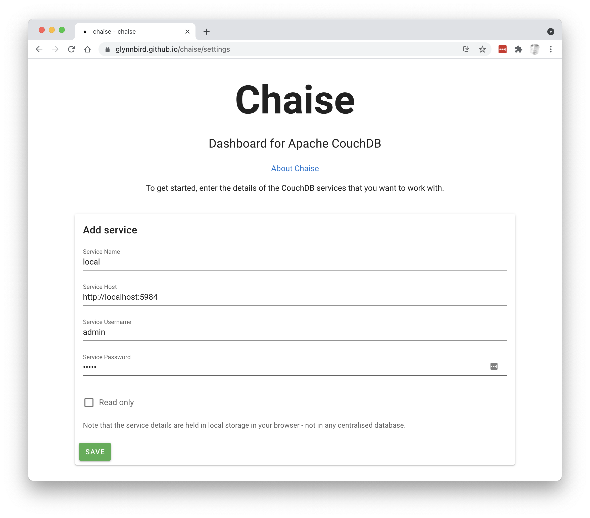

# chaise

Chaise is a dashboard for Apache CouchDB that allows multiple CouchDB services to be managed from the same place.

Use it: https://glynnbird.github.io/chaise/

> Note: The target CouchDB service must have "CORS" enabled.

## Features

- Configure any number of CouchDB/Cloudant services
- Switch between configured services at will
- See list of databases (filterable)
- See list of documents in a database (filter by _id) with pagination
- Add/edit/delete documents
- Query a database using simple SQL statements
- Configure a CouchDB service as "read only" and all add/edit/delete functions are disabled

## How does it work?

Chaise is a static web app hosted on GitHub Pages. 


Click "Add Service" to configure a new CouchDB service for Chaise to talk to. Note that Chaise stores its "state" (i.e. the list of configured services) in your browser's local storage, so your credentials are stored on your machine, not on some central database.



Fill in the form and Chaise will attempt to access your CouchDB service. Make sure the target CouchDB has CORS enabled.


You can configure as many services as you want and switch between them at any time. You may elect for your services to be "read only" so Chaise will hide any of the write, edit and delete operations from the dashboard.


When you select one of your services you will see a list of databases.


The list can be filtered by a string you provide.


Click into a database to see its contents. Page through the list of documents.


The list of documents can be filtered by the _start_ of the document `_id`.


For more advanced queries, click the SQL button or the spyclass in the top bar to visit the SQL querying page. When there is a blue "thumbs up" icon, then the query was answered with a secondary index.


Click into a document to see it in full and optionally edit or delete it.


The pull-out bar on the right contains handy links and a list of recently visited databases.

Click on the cog icon to pick a different service.

## Development

Clone this repo.

```bash
# install dependencies
$ npm install

# serve with hot reload at localhost:3000
$ npm run dev
```

## Special Directories

You can create the following extra directories, some of which have special behaviors. Only `pages` is required; you can delete them if you don't want to use their functionality.

### `assets`

The assets directory contains your uncompiled assets such as Stylus or Sass files, images, or fonts.

More information about the usage of this directory in [the documentation](https://nuxtjs.org/docs/2.x/directory-structure/assets).

### `components`

The components directory contains your Vue.js components. Components make up the different parts of your page and can be reused and imported into your pages, layouts and even other components.

More information about the usage of this directory in [the documentation](https://nuxtjs.org/docs/2.x/directory-structure/components).

### `layouts`

Layouts are a great help when you want to change the look and feel of your Nuxt app, whether you want to include a sidebar or have distinct layouts for mobile and desktop.

More information about the usage of this directory in [the documentation](https://nuxtjs.org/docs/2.x/directory-structure/layouts).


### `pages`

This directory contains your application views and routes. Nuxt will read all the `*.vue` files inside this directory and setup Vue Router automatically.

More information about the usage of this directory in [the documentation](https://nuxtjs.org/docs/2.x/get-started/routing).

### `plugins`

The plugins directory contains JavaScript plugins that you want to run before instantiating the root Vue.js Application. This is the place to add Vue plugins and to inject functions or constants. Every time you need to use `Vue.use()`, you should create a file in `plugins/` and add its path to plugins in `nuxt.config.js`.

More information about the usage of this directory in [the documentation](https://nuxtjs.org/docs/2.x/directory-structure/plugins).

### `static`

This directory contains your static files. Each file inside this directory is mapped to `/`.

Example: `/static/robots.txt` is mapped as `/robots.txt`.

More information about the usage of this directory in [the documentation](https://nuxtjs.org/docs/2.x/directory-structure/static).

### `store`

This directory contains your Vuex store files. Creating a file in this directory automatically activates Vuex.

More information about the usage of this directory in [the documentation](https://nuxtjs.org/docs/2.x/directory-structure/store).
